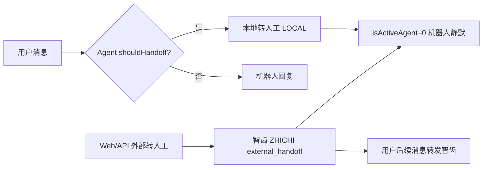

# 转人工双路径 — 实现与测试范围

> 依据 `whatsapp-bot-service` + `whatsapp-bot-frontend` | PRD §5.1/§6.3 描述智齿链路，**首版验收以代码为准（Q07 ✅）**

## Q07 结论（2026-06-30）

**用户说「转人工」或 Agent 判定转人工 → 默认走本地 Web 坐席（LOCAL）。**

| 首版 P0 验收 | 首版 Defer |
|--------------|------------|
| M5-LOCAL、TC-SMOKE-003-LOCAL/003b | M5-EXT、M6、TC-SMOKE-003-EXT |
| M7 经 **Web ChatPanel + sendManual** | M7 智齿工作台回传 |
| L2 handoff 断言：`isActiveAgent=0` / `handoff` | 智齿 groupid、history_messages 字段 |

PRD 与实现差异：PRD 写「调智齿在线客服接口」；代码为 **LOCAL_ONLY**。产品口径：**以代码为准**，PRD 修订可后续同步。

## 两条路径

| 路径 | 代码入口 | 会话状态 | 首版测试 |
|------|----------|----------|----------|
| **本地转人工** | `AgentRuntime.markLocalHandoff` → `AgentAssignmentService` | `handoffTarget=LOCAL`，Web 在线坐席 | **P0** M5-LOCAL、M7-Web |
| **智齿外部转人工** | `POST .../external-handoff` | `external_handoff`，传 groupid | **Defer** M5-EXT、M6 |

- `BotConfig.humanHandoffMode` 默认 `LOCAL_ONLY`
- 用户口语「转人工」**不会**自动调智齿 API

## G2 冒烟（LOCAL）

| 用例 | 操作 | 预期 |
|------|------|------|
| TC-SMOKE-003-LOCAL | 发「转人工」 | Web 工作台出现会话/分配；`isActiveAgent=0` |
| TC-SMOKE-003b | 转人工后再发 2 条 | 无机器人 outbound（Q02） |
| TC-SMOKE-004 | Web 坐席 **sendManual** 回复 | 用户侧（webhook 模拟或真机）收到 |

前端：`whatsapp-bot-frontend` → 登录 → 会话列表 → ChatPanel → 发消息。

## Q02（已确认）

两条路径均：`isActiveAgent=0` 或 `external_handoff` 后，机器人 **不再自动回复**。必测 TC-SMOKE-003b / TC-M5-010。

## EXT 路径（Defer，联调时启用）

M6 与 M5-F01~F06 须先调用 **external-handoff**，不可仅用「转人工」三字触发。启用条件：产品排期智齿首版或 PRD 修订回智齿主链路。
